# Polyglot Codebase Knowledge Graph

> Generated offline by **readmenator**. Supports C, C++, Python, Go, Rust, JS/TS, Java, C#, Shell, PHP, Dart, GDScript, Nim, ASM.
> No LLMs. No tokens. Pure static analysis.

**Total Files Parsed:** 2 | **Total Symbols Extracted:** 4 | **Total Imports:** 6

## Structural Knowledge Map

```mermaid
graph TD
    classDef mod fill:#1e1e1e,stroke:#ff6666,stroke-width:2px,color:#fff;
    classDef cls fill:#2d2d2d,stroke:#4ec9b0,stroke-width:2px,color:#fff;
    classDef fn fill:#333,stroke:#dcdcaa,stroke-width:1px,color:#dcdcaa;
    classDef ext fill:#111,stroke:#666,stroke-dasharray: 5 5,color:#aaa;
    shadow_c["shadow.c (c)"]
    class shadow_c mod;
    shadow_c_read_file_sigilent["read_file_sigilent"]
    class shadow_c_read_file_sigilent fn;
    shadow_c --> shadow_c_read_file_sigilent
    shadow_c_main["main"]
    class shadow_c_main fn;
    shadow_c --> shadow_c_main
    shadow_c__GNU_SOURCE["_GNU_SOURCE"]
    class shadow_c__GNU_SOURCE fn;
    shadow_c --> shadow_c__GNU_SOURCE
    shadow_c_ENTRIES["ENTRIES"]
    class shadow_c_ENTRIES fn;
    shadow_c --> shadow_c_ENTRIES
    compile_sh["compile.sh (sh)"]
    class compile_sh mod;
    ext_stdio_h["stdio.h"]
    class ext_stdio_h ext;
    shadow_c -.->|imports| ext_stdio_h
    ext_stdlib_h["stdlib.h"]
    class ext_stdlib_h ext;
    shadow_c -.->|imports| ext_stdlib_h
    ext_fcntl_h["fcntl.h"]
    class ext_fcntl_h ext;
    shadow_c -.->|imports| ext_fcntl_h
    ext_string_h["string.h"]
    class ext_string_h ext;
    shadow_c -.->|imports| ext_string_h
    ext_unistd_h["unistd.h"]
    class ext_unistd_h ext;
    shadow_c -.->|imports| ext_unistd_h
    ext_liburing_h["liburing.h"]
    class ext_liburing_h ext;
    shadow_c -.->|imports| ext_liburing_h
```

---

## Architecture Reference

### C (1 files)

#### `shadow.c`
**Path:** `shadow.c`

**Functions:**
- `read_file_sigilent` (line 11) - *gcc -o shadow shadow.c -luring define _GNU_SOURCE include <stdio.h> include <stdlib.h> include <fcntl.h> include <string.h> include <unistd.h> incl...*
- `main` (line 47)

**Macros:**
- `_GNU_SOURCE` (line 2)
- `ENTRIES` (line 9)

### SH (1 files)

#### `compile.sh`
**Path:** `compile.sh`

*No symbols extracted*
