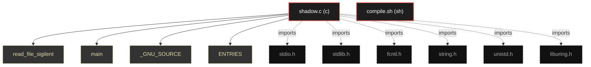

# Polyglot Codebase Knowledge Graph

> Generated offline by **readmenator**. 2 files, 4 symbols, 6 imports. Supports C, C++, Python, Go, Rust, JS/TS, Java, C#, Shell, PHP, Dart, GDScript, Nim, ASM, Ruby, Swift, Kotlin, Scala, Lua, Elixir.
> No LLMs. No tokens. Pure static analysis. See more [here](https://github.com/grisuno/ReadMenator)

**Start here:** Statistics Dashboard for scope, God Nodes for blast radius, Architecture Reference for per-file API. Agents: prefer `readmenator-agent/INDEX.md` + `SYMBOLS.md`.

**Wiki:** prefer `readmenator-wiki/index.md` for progressive disclosure: one synthesis page per community, `connections.json` with EXTRACTED vs INFERRED confidence, `queries.md` log, `REPORT.md` audit.

**Confidence:** EXTRACTED = parsed from source, INFERRED = heuristic bridge, AMBIGUOUS = reported, never hidden. See `readmenator-wiki/REPORT.md`.

**Total Files Parsed:** 2 | **Total Symbols Extracted:** 4 | **Total Imports:** 6

<!-- ranking_model: v1.0 | weights: {ppr:0.45,auth:0.2,test:0.15,doc:0.1,fresh:0.1} | alpha:0.85 | commit:b3ca3bb | date:2026-07-18 -->


## Table of Contents

1. [Statistics Dashboard](#statistics-dashboard)
2. [Architectural Layers](#architectural-layers)
3. [Ranked Context](#ranked-context)
4. [God Nodes](#god-nodes)
5. [Suggested Questions](#suggested-questions)
6. [Hotspot Analysis](#hotspot-analysis)
7. [Change Impact Analysis](#change-impact-analysis)
8. [Orphans](#orphans)
9. [Query Recipes](#query-recipes)
10. [Structural Knowledge Map](#structural-knowledge-map)
11. [UML Class Diagram](#uml-class-diagram)
12. [Code Property Graph](#code-property-graph)
13. [Architecture Reference](#architecture-reference)
    - [C (1 files)](#c-1-files)
    - [SH (1 files)](#sh-1-files)

---

## Statistics Dashboard

| Metric | Value |
|--------|-------|
| Total Files | 2 |
| Total Symbols | 4 |
| Total Imports | 6 |
| Call Edges | 0 |
| Inheritance Edges | 0 |
| Languages | 2 |
| Avg Symbols/File | 2.0 |
| Avg Imports/File | 3.0 |

### Top Files by Import Count (Fan-Out)

| File | Imports | Symbols | Language |
|------|---------|---------|----------|
| `shadow.c` | 6 | 4 | c |

---

## Architectural Layers

Auto-detected from path patterns, naming conventions, and imported frameworks.

| Layer | Files |
|-------|-------|
| utility | 2 |

### utility

- `compile.sh` (sh, 0 symbols)
- `shadow.c` (c, 4 symbols)

---

## Ranked Context

Files ranked by composite score for the current query context. The ranking combines Personalized PageRank (query relevance), global authority, test coverage, documentation coverage, and code freshness. Model: v1.0.

| Rank | File | Composite | PPR | Authority | Test | Doc |
|------|------|-----------|-----|-----------|------|-----|
| 1 | `shadow.c` | 0.0250 | 0.0000 | 0.0000 | 0.00 | 0.25 |
| 2 | `compile.sh` | 0.0000 | 0.0000 | 0.0000 | 0.00 | 0.00 |

---

## God Nodes

Most architecturally central files ranked by combined import/export degree and symbol richness.

| File | Score | Connections | PageRank |
|------|-------|-------------|----------|
| `shadow.c` | 0.4 | | 0.0000 |
| `compile.sh` | 0.0 | | 0.0000 |

---

## Suggested Questions

Auto-generated exploration prompts based on graph structure:

- What does shadow.c depend on, and what depends on it? (0 connections)
- What does compile.sh depend on, and what depends on it? (0 connections)
- What is the overall architecture of this codebase?

---

## Hotspot Analysis

Files ranked by combined complexity (symbol count) and centrality (connection count). High-scoring files are architecturally critical and may need refactoring attention.

| File | Complexity | Centrality | Combined | Symbols | Connections |
|------|-----------|------------|----------|---------|-------------|
| `shadow.c` | 1.000 | 1.000 | 1.000 | 4 | 6 |
| `compile.sh` | 0.000 | 0.000 | 0.000 | 0 | 0 |

---

## Change Impact Analysis

Files sorted by how many other files would be affected if they changed. High-impact files should be changed with caution.

| File | Direct Dependents | Transitive Dependents | Total Impact |
|------|------------------|----------------------|--------------|
| `compile.sh` | 0 | 0 | 0 |
| `shadow.c` | 0 | 0 | 0 |

---

## Orphans

Files with no documentation or low connectivity. These are candidates for documentation investment or cleanup.

- `compile.sh` (0 symbols, no doc)

---

## Query Recipes

Example queries you can run against this knowledge base using the ranking engine:

```
# Find files most relevant to a concept
readmenator query "Where is the import resolver implemented?"

# Rank files by relevance to a topic
readmenator query "How does documentation generation work?"

# Explain why a file ranks highly
readmenator query "explain readmenator/_documentation.py"

# Trace dependency paths with ranked context
readmenator query "path from CLI to exporter"
```

The ranking model uses the following signals:

- **Personalized PageRank** (45% weight): query-specific relevance via seed propagation
- **Global Authority** (20% weight): structural importance via standard PageRank
- **Test Coverage** (15% weight): fraction of symbols referenced in test files
- **Doc Coverage** (10% weight): presence of docstrings and file-level docs
- **Freshness** (10% weight): recent modification activity

Results include score decomposition and justification paths for each ranked item.

---

## Structural Knowledge Map


```mermaid
graph TD
    classDef mod fill:#1e1e1e,stroke:#ff6666,stroke-width:2px,color:#fff;
    classDef cls fill:#2d2d2d,stroke:#4ec9b0,stroke-width:2px,color:#fff;
    classDef fn fill:#333,stroke:#dcdcaa,stroke-width:1px,color:#dcdcaa;
    classDef ext fill:#111,stroke:#666,stroke-dasharray:5 5,color:#aaa;
    shadow_c["shadow.c (c)"]
    class shadow_c mod;
    shadow_c_read_file_sigilent["read_file_sigilent"]
    class shadow_c_read_file_sigilent fn;
    shadow_c --> shadow_c_read_file_sigilent
    shadow_c_main["main"]
    class shadow_c_main fn;
    shadow_c --> shadow_c_main
    shadow_c__GNU_SOURCE["_GNU_SOURCE"]
    class shadow_c__GNU_SOURCE fn;
    shadow_c --> shadow_c__GNU_SOURCE
    shadow_c_ENTRIES["ENTRIES"]
    class shadow_c_ENTRIES fn;
    shadow_c --> shadow_c_ENTRIES
    compile_sh["compile.sh (sh)"]
    class compile_sh mod;
    ext_stdio_h["stdio.h"]
    class ext_stdio_h ext;
    shadow_c -.->|imports| ext_stdio_h
    ext_stdlib_h["stdlib.h"]
    class ext_stdlib_h ext;
    shadow_c -.->|imports| ext_stdlib_h
    ext_fcntl_h["fcntl.h"]
    class ext_fcntl_h ext;
    shadow_c -.->|imports| ext_fcntl_h
    ext_string_h["string.h"]
    class ext_string_h ext;
    shadow_c -.->|imports| ext_string_h
    ext_unistd_h["unistd.h"]
    class ext_unistd_h ext;
    shadow_c -.->|imports| ext_unistd_h
    ext_liburing_h["liburing.h"]
    class ext_liburing_h ext;
    shadow_c -.->|imports| ext_liburing_h
```

---

## Code Property Graph

Machine-readable Code Property Graph (CPG) in JSON-LD format. This block allows AI agents to parse the full structural graph without additional file reads. Compatible with GraphRAG pipelines.

```json
{"@context": "https://schema.org", "analysis": {"communities": [], "god_nodes": [{"node_id": "shadow.c", "score": 0.4}, {"node_id": "compile.sh", "score": 0.0}], "surprising_connections": []}, "edges": [{"confidence": "EXTRACTED", "relation": "imports", "source": "shadow.c", "target": "stdio.h"}, {"confidence": "EXTRACTED", "relation": "imports", "source": "shadow.c", "target": "stdlib.h"}, {"confidence": "EXTRACTED", "relation": "imports", "source": "shadow.c", "target": "fcntl.h"}, {"confidence": "EXTRACTED", "relation": "imports", "source": "shadow.c", "target": "string.h"}, {"confidence": "EXTRACTED", "relation": "imports", "source": "shadow.c", "target": "unistd.h"}, {"confidence": "EXTRACTED", "relation": "imports", "source": "shadow.c", "target": "liburing.h"}], "generator": "readmenator", "metadata": {"edge_count": 6, "file_count": 2, "language_count": 2, "symbol_count": 4}, "nodes": [{"id": "compile.sh", "kind": "module", "label": "compile.sh", "language": "sh", "sha256": "aa9ad6e6970f236e", "symbol_count": 0, "symbols": []}, {"doc": "gcc -o shadow shadow.c -luring", "id": "shadow.c", "kind": "module", "label": "shadow.c", "language": "c", "sha256": "45310e653c7d1f2b", "symbol_count": 4, "symbols": [{"kind": "function", "line": 12, "name": "read_file_sigilent", "signature": "int read_file_sigilent(const char *path, char *buffer, size_t bufsize)"}, {"kind": "function", "line": 48, "name": "main", "signature": "int main()"}, {"kind": "macro", "line": 2, "name": "_GNU_SOURCE", "signature": "#define _GNU_SOURCE"}, {"kind": "macro", "line": 10, "name": "ENTRIES", "signature": "#define ENTRIES"}]}], "type": "CodePropertyGraph", "version": "1.0"}
```

---

## Architecture Reference

### C (1 files)

#### `shadow.c`
**Path:** `shadow.c`
**File Doc:** *gcc -o shadow shadow.c -luring*

**Functions:**
- `read_file_sigilent` (line 12) `int read_file_sigilent(const char *path, char *buffer, size_t bufsize)`
- `main` (line 48) `int main()`

**Macros:**
- `_GNU_SOURCE` (line 2) `#define _GNU_SOURCE`
- `ENTRIES` (line 10) `#define ENTRIES`

### SH (1 files)

#### `compile.sh`
**Path:** `compile.sh`

*No symbols extracted*
